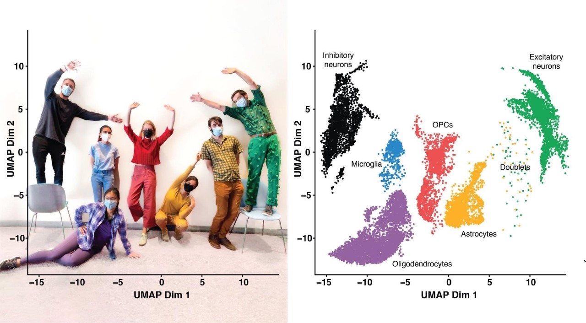
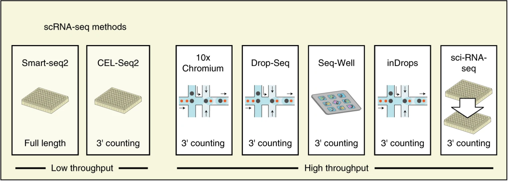

# Installation

Install the ExpDesign2021 package from github, if you haven't already.
If you're knitting this on your own machine, you will want to load knitr too.


```r
#install.packages("remotes")
#install.packages("BiocManager")
#BiocManager::install("VanAndelInstitute/ExpDesign2021", build_vignettes=TRUE)
```


```r
library(knitr)
```

To extract just the R code, you can use knitr::knit(input, tangle=TRUE):


```r
knitr::knit("project2.Rmd", tangle = TRUE) 
#> Error in parse_block(g[-1], g[1], params.src, markdown_mode): Duplicate chunk label 'setup', which has been used for the chunk:
#> knitr::opts_chunk$set(echo = TRUE)
#> knitr::opts_chunk$set(collapse = TRUE, comment = "#>")
#> library(devtools)
#> load_all("./")
# [1] "project2.R"
```


# Introduction



_Extra credit assignment: figure out whose lab the above came from_

For project 2 ("design your own damned experiment"), the class boldly rallied 
behind Richard Cassidy's suggestion of using single-cell RNA-seq data for an 
example dataset. This seemed like a great idea: it's big, it's messy, and it 
accompanies a [glam paper for a blue-collar experiment](https://www.nature.com/articles/s41587-020-0465-8), which is kind of cool. (The paper also covers 
single-cell vs. single-nucleus RNAseq comparisons, but we won't go there yet.)
The cell mixture model (HEK293 human cells and NIH3T3 mouse cells) is straight-
forward (mix two types of cells in two test tubes and then split).


# The Broad Institute barnyard data

The library preparation methods involved in the paper may bear explanation. 
Short-read RNA sequencing experiments require cDNA as their input, since most
sequencers expect to call bases from DNA; as a consequence, one must first make
libraries of cDNA molecules from fragmented mRNA. Numerous approaches exist, 
six of which are employed here. 



[The data is available from GEO](https://www.ncbi.nlm.nih.gov/geo/query/acc.cgi?acc=GSE132044) although it's a bit unwieldy, weighing in at 300MB for the cell
mixture model counts alone. Happily, we can load up the metadata without that.

## Cells


```r

# read in the cell names for the count matrix directly from GEO 
cells <- readLines(gzcon(url("https://ftp.ncbi.nlm.nih.gov/geo/series/GSE132nnn/GSE132044/suppl/GSE132044_mixture_hg19_mm10_cell.tsv.gz")))

# tidy things up 
library(stringr)
library(tidyverse)

# now decode the metadata from it
tibble(name = cells) %>% 
  mutate(experiment = str_split(name, "\\.", simplify=TRUE)[,1]) %>% 
  mutate(method = str_split(name, "\\.", simplify=TRUE)[,2]) %>% 
  mutate(cell = str_split(name, "\\.", simplify=TRUE)[,3]) ->
    celltibble 

# how many cells per mixture were run with each method?
with(celltibble, 
     table(method, experiment))
#>                  experiment
#> method            Mixture1 Mixture2
#>   10x-Chromium-v2     3159     3187
#>   CEL-Seq2             359      347
#>   Drop-seq            2594     3812
#>   Seq-Well            1627     1012
#>   Smart-seq2           342      343
#>   inDrops             3081     2529
#>   sci-RNA-seq          299     5023
```

Arguably, we don't need more than (say) 300 cells per method for this exercise,
and it would be nice not to demolish your computers' RAM (even though we're not
using Seurat or some piggish monstrosity like that). So we'll probably chop down
the number of cells from which you resample, at least for this project. If you
are familiar with block resampling, you already know where this is going. 

## Genes 

We can do the same type of thing for the genes involved, albeit without the 
intention of chopping them down by much if at all:


```r

# read in the gene names for the count matrix directly from GEO 
genes <- readLines(gzcon(url("https://ftp.ncbi.nlm.nih.gov/geo/series/GSE132nnn/GSE132044/suppl/GSE132044_mixture_hg19_mm10_gene.tsv.gz")))

# tidy things up 
library(stringr)
library(tidyverse)

# now decode the metadata from it
tibble(name = genes) %>% 
  mutate(ensembl = str_split(name, "_", simplify=TRUE)[,2]) %>%
  mutate(genome = str_split(name, "_", simplify=TRUE)[,3]) ->
    genetibble 

# how many genes per assembly? 
with(genetibble, table(genome))
#> genome
#>  hg19  mm10 
#> 33354 28692
```

_Question: why didn't we use the gene symbols in columns 4:6?_

With the release of Bioconductor 3.14, the project includes a tidy single cell 
experiment (data structure) package, which is great since all other single cell 
data structures kind of suck. (No, seriously, you'll find out why eventually.) 
The package is, not coincidentally, called [tidySingleCellExperiment](http://www.bioconductor.org/packages/release/bioc/vignettes/tidySingleCellExperiment/inst/doc/introduction.html):


```r

if (!require("tidySingleCellExperiment")) {
  BiocManager::install("tidySingleCellExperiment")
  library(tidySingleCellExperiment)
}

```


# Chopping down the data to fit in RAM

Above, I stated that maybe we don't need thousands of cells per method. 
(This is arguable; in exchange for crappy per-cell results, 10X and similar
offer more cells at the price of more dropouts and less sensitivity per cell.)
No worries, we'll just go ahead and downsample "enough" cells per method.
It turns out this happens to me often enough that I wrote some code to do it:


```r

# adapted from a SingleCellExperiment-centric method for CITEseq
sample_umis <- function(umis, meta, block, ideal=300) {

  stopifnot(nrow(meta) == ncol(umis))
  stopifnot(length(block) == nrow(meta))

  pops <- sort(table(block))
  samplesets <- split(seq_len(nrow(meta)), block)

  keep <- integer()
  for (set in names(samplesets)) {
    sset <- samplesets[[set]]
    cells <- length(sset)
    if (cells <= ideal) {
      pct <- 100
      keep <- c(keep, sset)
      message("Kept ", cells, " cells (", pct, "%) of type ", set, ".")
    } else {
      kept <- sample(sset, size=ideal)
      pct <- round((ideal / cells) * 100)
      keep <- c(keep, kept)
      message("Kept ", ideal, " cells (", pct, "%) of type ", set, ".")
    }
  }

  pct <- round((length(keep) / ncol(umis)) * 100, 1)
  message("Kept ", length(keep), " (", pct, "%) of ", ncol(umis),
          " cells in ", length(samplesets), " blocks.")
  umis[, keep]

}
```

_Question: can you generate block-random samples from the metadata you have?_

It's possible your machine or instance would crash if you did the following
(apparently nobody told IT that a laptop is a device to take RAM on a plane). 
I'm going to stick to the above "1000 cells ought to be enough" and do this:


```r

# pre-downloaded MatrixMarket file from GEO
library(Matrix)

# put it into a column-sparse Matrix object to avoid wasting heaps of RAM
umi_counts <- as(readMM("matrix.mtx.gz"), "dgCMatrix")

# never trust anyone, including yourself 
stopifnot(nrow(umi_counts) == nrow(genetibble))
stopifnot(ncol(umi_counts) == nrow(celltibble))

# bolt the dimensions back onto the data
rownames(umi_counts) <- genetibble$name
colnames(umi_counts) <- celltibble$name

# create a basis for blocked downsampling
celltibble %>%
  mutate(block = paste(method, experiment, sep="_")) -> 
    blocktibble 

# block downsample 
downsampled <- sample_umis(umi_counts, blocktibble, blocktibble$block)
# Kept 300 cells (9%) of type 10x-Chromium-v2_Mixture1.
# Kept 300 cells (9%) of type 10x-Chromium-v2_Mixture2.
# Kept 300 cells (84%) of type CEL-Seq2_Mixture1.
# Kept 300 cells (86%) of type CEL-Seq2_Mixture2.
# Kept 300 cells (12%) of type Drop-seq_Mixture1.
# Kept 300 cells (8%) of type Drop-seq_Mixture2.
# Kept 300 cells (10%) of type inDrops_Mixture1.
# Kept 300 cells (12%) of type inDrops_Mixture2.
# Kept 299 cells (100%) of type sci-RNA-seq_Mixture1.
# Kept 300 cells (6%) of type sci-RNA-seq_Mixture2.
# Kept 300 cells (18%) of type Seq-Well_Mixture1.
# Kept 300 cells (30%) of type Seq-Well_Mixture2.
# Kept 300 cells (88%) of type Smart-seq2_Mixture1.
# Kept 300 cells (87%) of type Smart-seq2_Mixture2.
# Kept 4199 (15.2%) of 27714 cells in 14 blocks.

saveRDS(downsampled, file="barnyard_umi_sample.rds") 
# online at https://ttriche.github.io/RDS/barnyard_umi_sample.rds

```

Right then, let's get to work. You might consider running through some of the 
steps in the [tidySingleCellExperiment vignette](http://www.bioconductor.org/packages/release/bioc/vignettes/tidySingleCellExperiment/inst/doc/introduction.html) to start with.  If your laptop or Rstudio Cloud instance still blows up, let 
me know and I'll create some smaller-er downsamples (also a familiar practice).


```r

# need to install from Bioconductor, 
# unless we're going to dork around with individual genes right from the start
library(SingleCellExperiment) 

# create the column (cell) annotation data frame
column_data <- as(celltibble, "DataFrame")
rownames(column_data) <- column_data$name
column_data <- column_data[colnames(downsampled), ]

# create the row (gene) annotation data frame
row_data <- as(genetibble, "DataFrame")
rownames(row_data) <- row_data$name
row_data <- row_data[rownames(downsampled), ]

# create a SingleCellExperiment
barnyard <- SingleCellExperiment(SimpleList(counts=downsampled),
                                 rowData=row_data, 
                                 colData=column_data)
saveRDS(barnyard, file="barnyard.rds") 

# turn the result into a tidySCE
tidybarnyard <- tidy(barnyard)

```

You can just load the result: 


```r

library(tidySingleCellExperiment)
tidybarnyard <- tidy(readRDS(url("https://ttriche.github.io/RDS/barnyard.rds")))
show(tidybarnyard)
#> # A SingleCellExperiment-tibble abstraction: 4,199 × 5
#> # Features=62046 | Assays=counts
#>    cell                                      name      experiment method  cell  
#>    <chr>                                     <chr>     <chr>      <chr>   <chr> 
#>  1 Mixture1.10x-Chromium-v2.GGGCATCGTCACACGC Mixture1… Mixture1   10x-Ch… GGGCA…
#>  2 Mixture1.10x-Chromium-v2.CACATAGAGATACACA Mixture1… Mixture1   10x-Ch… CACAT…
#>  3 Mixture1.10x-Chromium-v2.CACTCCATCCTCCTAG Mixture1… Mixture1   10x-Ch… CACTC…
#>  4 Mixture1.10x-Chromium-v2.TATGCCCGTTAAGATG Mixture1… Mixture1   10x-Ch… TATGC…
#>  5 Mixture1.10x-Chromium-v2.CACAGGCTCCTTTCTC Mixture1… Mixture1   10x-Ch… CACAG…
#>  6 Mixture1.10x-Chromium-v2.TTTGCGCAGTGGTAGC Mixture1… Mixture1   10x-Ch… TTTGC…
#>  7 Mixture1.10x-Chromium-v2.CGATCGGGTCATCCCT Mixture1… Mixture1   10x-Ch… CGATC…
#>  8 Mixture1.10x-Chromium-v2.GTTAAGCCACCTGGTG Mixture1… Mixture1   10x-Ch… GTTAA…
#>  9 Mixture1.10x-Chromium-v2.AACTTTCCATAGACTC Mixture1… Mixture1   10x-Ch… AACTT…
#> 10 Mixture1.10x-Chromium-v2.GAAGCAGCAGTTCATG Mixture1… Mixture1   10x-Ch… GAAGC…
#> # … with 4,189 more rows
```

I'd suggest, as a first pass, trying to sort out which are the mouse 3T3 cells,
and which are the human HEK293 cells. We can discuss this in class on Monday.

_Question: What's the easiest way to distinguish the mouse and human cells?_

_Question: Can you think of a way to distinguish male from female cells?_

_Question: Are the two answers above roughly equivalent?  Why?_

Bonus points if you can say where the two cell lines originally came from, and 
why the HEK cells don't have the usual PHI-non-compliant names from that time.
